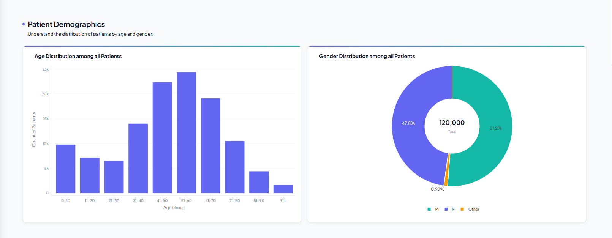
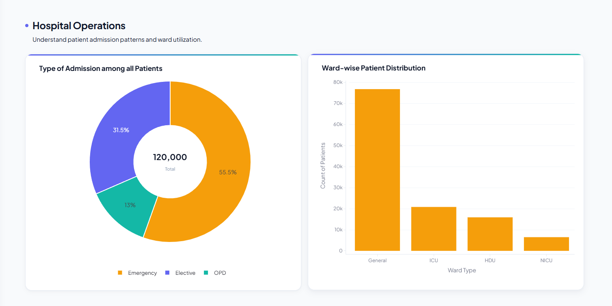
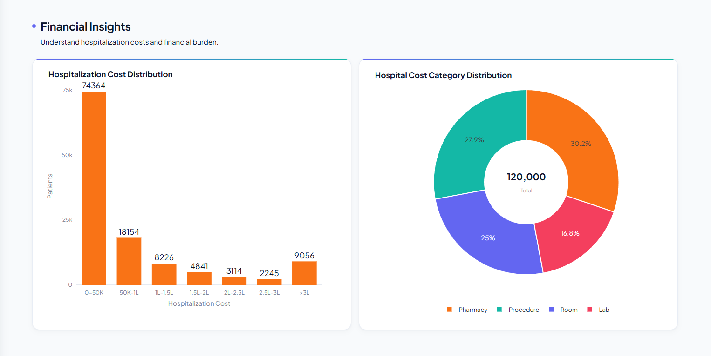
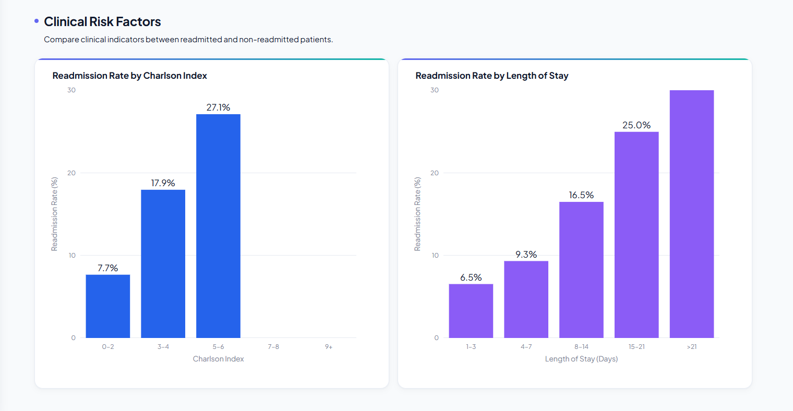
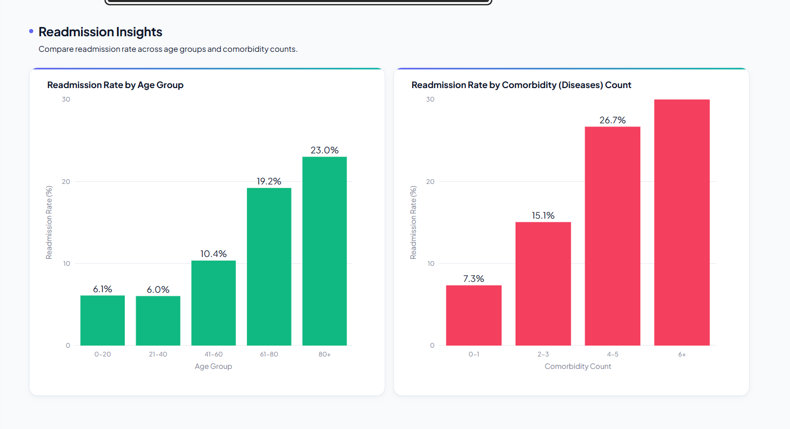

# 3. Exploratory Data Analysis (EDA)

## 3.1 Introduction

Exploratory Data Analysis (EDA) is a critical step in the machine learning pipeline. Before training predictive models, it is essential to understand the characteristics of the dataset, identify potential quality issues, examine variable distributions, and discover meaningful relationships between features.

For this project, EDA was performed to:

- Understand patient demographics.
- Study hospital admission patterns.
- Analyze clinical risk factors.
- Examine financial characteristics.
- Investigate factors associated with hospital readmissions.
- Identify preprocessing requirements before model development.

---

# 3.2 Objectives of EDA

The primary objectives were:

- Understand the overall structure of the dataset.
- Explore numerical and categorical variables.
- Detect missing values.
- Examine feature distributions.
- Identify outliers.
- Study relationships between important variables.
- Generate business insights useful for healthcare administrators.

---

# 3.3 Patient Demographics

Patient demographic analysis provides an overview of the population represented in the dataset.

The following variables were analyzed:

- Age
- Gender
- Below Poverty Line (BPL)
- Insurance Details 

The objective was to identify demographic groups that contribute significantly to hospital admissions and evaluate whether these characteristics influence readmission risk.

> **Insert Dashboard Screenshot:** 

---

## Key bservations`    

- The majority of hospital admissions belong to middle-aged and elderly patients.
- Male and female admissions are relatively balanced.
- Age will be an important predictor for the readmission model.

---

# 3.4 Hospital Operations

Operational analysis helps understand hospital resource utilization.

The following variables were explored:

- Admission Type
- Ward Type
- ICU Admissions
- Length of Stay

The analysis provides insights into patient flow and hospital workload.

> **Insert Dashboard Screenshot:**

---

## Key Observations

- Emergency admissions contribute significantly to hospital occupancy.
- General wards account for the majority of patient admissions.
- Longer hospital stays are associated with greater clinical complexity.
- ICU admissions represent patients with higher severity.

---

# 3.5 Financial Analysis

Financial analysis examines the economic burden associated with patient admissions.

Variables analyzed include:

- Total Hospitalization Cost
- Cost Category

Hospital costs were grouped into meaningful ranges to simplify interpretation.

> **Insert Dashboard Screenshot:** 

---

## Key Observations

- Most admissions fall within lower hospitalization cost ranges.
- A relatively small number of patients contribute to high-very high treatment costs.
- Higher treatment costs often coincide with longer hospital stays and increased clinical complexity.

---

# 3.6 Clinical Risk Analysis

Clinical indicators were explored to understand their relationship with readmission.

The primary variables include:

- Charlson Comorbidity Index
- Number of Comorbidities
- Diabetes Status
- HbA1c
- Length of Stay

These variables are known indicators of disease severity.

> **Insert Dashboard Screenshot:** 

---

## Key Observations

- Patients with higher Charlson Index scores exhibit higher readmission rates.
- Increasing comorbidity burden is associated with greater clinical risk.
- Longer hospital stays often correspond to more severe conditions.
- Clinical variables demonstrate stronger predictive power than demographic variables alone.

---

# 3.7 Readmission Analysis

The target variable was analyzed across multiple patient groups to identify trends.

The following relationships were explored:

- Readmission vs Age Group
- Readmission vs Length of Stay
- Readmission vs Charlson Index
- Readmission vs Comorbidity Count

> **Insert Dashboard Screenshot:** 

---

## Key Observations

- Readmission probability increases with patient age.
- Patients with multiple comorbidities show elevated readmission risk.
- We've previously observed that increased Charlson Index scores correspond to higher readmission rates.
- Extended hospital stays are associated with increased likelihood of readmission.

---

# 3.8 Data Quality Assessment

During EDA, the following aspects were examined:

- Missing values
- Duplicate records
- Invalid entries
- Outlier distributions
- Feature data types

These findings guided subsequent preprocessing and feature engineering steps.

---

# 3.9 Business Insights

The exploratory analysis generated several actionable insights for healthcare administrators.

Examples include:

- Elderly patients require closer post-discharge monitoring.
- Patients with multiple chronic conditions represent high-risk populations.
- High-cost admissions often indicate clinically complex cases.
- Patients with prolonged hospitalization should receive enhanced discharge planning.
- Readmission prevention strategies should prioritize high-risk patient groups identified during EDA.

---

# 3.10 Summary

Exploratory Data Analysis provided valuable insights into patient demographics, operational characteristics, financial trends, and clinical risk factors.

These findings informed the preprocessing strategy, feature engineering process, and machine learning model development presented in the subsequent chapters.