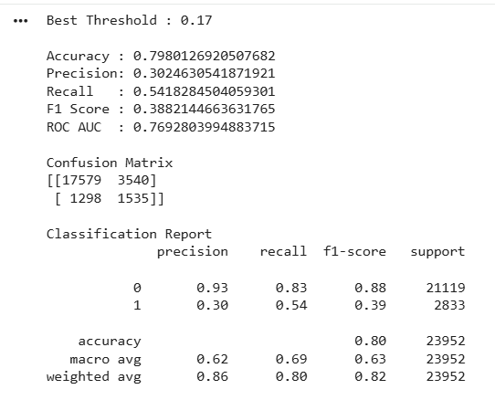

# 8. Model Performance Evaluation

## 8.1 Introduction

After training the CatBoost classifier, the model was evaluated on an unseen testing dataset to measure its ability to generalize to new patient records.

Multiple evaluation metrics were used to assess different aspects of predictive performance.

---

# 8.2 Evaluation Metrics & Performance of the Model

The following metrics were used:

| Metric | Value |
| ------- | ------|
| Accuracy |~ 80%| 
|Precision |0.311|
|Recall|  0.51 |
|F1 Score | ~0.39|
|ROC-AUC Score | 0.769|

Using multiple metrics provides a more comprehensive assessment than relying solely on accuracy, particularly for healthcare prediction tasks.

---

# 8.3 Confusion Matrix

The confusion matrix summarizes the model's prediction outcomes.

    

<b>Figure 8.1:</b> Confusion Matrix of the Final CatBoost Model

---

# 8.4 AUC-ROC 

The Receiver Operating Characteristic (ROC) Curve illustrates the trade-off between the True Positive Rate and the False Positive Rate across different classification thresholds which yields to a value of 0.769.

---

# 8.5 Discussion

The CatBoost classifier demonstrated a decent predictive performance across multiple evaluation metrics. Though the F1 Score was small, but it's not an Algorithmic Fault or a procedural fault. The features present in the dataset contain information upto certain extent, and majority of it were captured by the CatBoost Algorithm.  

The same can be evidenced by the overlap of F1 Scores of all the Algorithms used (Random Forest, Balanced Random Forest, XGBoost, CatBoost yielded an F1 Score ranged between 0.31-0.39, However the CatBoost algorithm is preferred due to its balance between Precision and Recall). This project does not assert highest F1 Score, but delivered a decent F1 Score based on the dataset. However, additional improvement of F1 Score requires and additional information/features that has to be added in the dataset.

The model achieved consistent performance on previously unseen patient records, indicating good generalization capability.

---

# 8.6 Summary

The evaluation results indicate that the selected CatBoost model provides reliable predictions for identifying patients at risk of 30-day hospital readmission.

The optimized model was subsequently integrated into the Streamlit application for real-time inference.